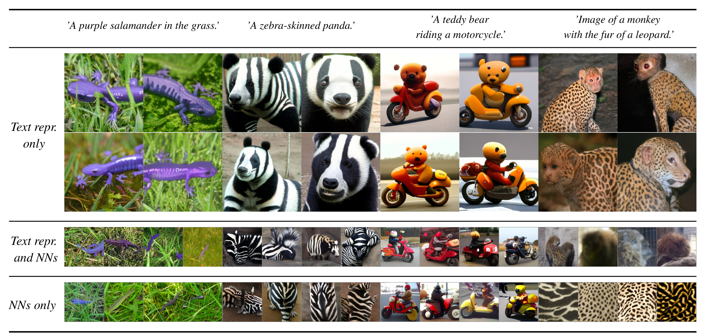
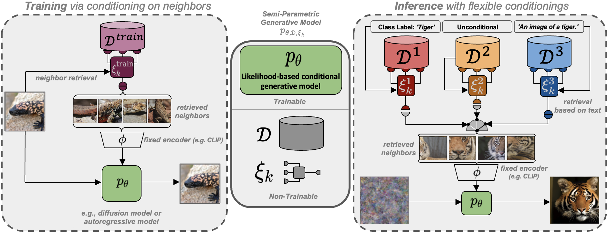

# Retrieval-Augmented Diffusion Models
[arXiv](https://arxiv.org/abs/2204.11824) | [BibTeX](#bibtex)



[**Retrieval-Augmented Diffusion Models**](https://arxiv.org/abs/2204.11824)<br/>
[Andreas Blattmann](https://github.com/ablattmann)\*,
[Robin Rombach](https://github.com/rromb)\*,
[Kaan Oktay](https://github.com/kaanoktay)\,
[Jonas Müller](https://github.com/jenuk),
[Björn Ommer](https://hci.iwr.uni-heidelberg.de/Staff/bommer)<br/>
\* equal contribution



## News

### April 2023
- Code release

## Requirements
A suitable [conda](https://conda.io/) environment named `rdm` can be created
and activated with:

```bash
conda env create -f environment.yaml
conda activate rdm
```

# Pretrained Models
A general list of all available checkpoints is available in via our [model zoo](#model-zoo).
If you use any of these models in your work, we are always happy to receive a [citation](#bibtex).

Example inference notebooks can be found under `scripts/demo_rdm.ipynb` and `scripts/demo_rarm.ipynb`.

### Database

To be able to run a RDM/RARM conditioned on a text-prompt and additionally images retrieved from this prompt, you will also need to download the corresponding retrieval database.
We provide two distinct databases extracted from the [Openimages-](https://storage.googleapis.com/openimages/web/index.html) and [ImageNet](https://www.image-net.org/) datasets.
Interchanging the databases results in different capabilities of the model as visualized below, although the learned weights are the same in both cases.

Download the retrieval-databases which contain the retrieval-datasets ([Openimages](https://storage.googleapis.com/openimages/web/index.html) (~18GB) and [ImageNet](https://www.image-net.org/) (~1GB)) compressed into CLIP image embeddings:
```bash
bash scripts/download_databases.sh
```

### RDM
Since CLIP offers a shared image/text feature space, and RDMs learn to cover a neighborhood of a given
example during training, we can directly take a CLIP text embedding of a given prompt and condition on it.
Run this mode via
```bash
python scripts/rdm_sample.py  --caption "a happy bear reading a newspaper, oil on canvas" --gpu 0
```

or sample the model unconditionally
```bash
python scripts/rdm_sample.py  --gpu 0
```
### RARM
RARMs can be used in a similar manner to RDMs with
```bash
python scripts/rarm_sample.py  --caption "a happy bear reading a newspaper, oil on canvas" --gpu 0
```

and sample the model unconditionally
```bash
python scripts/rarm_sample.py  --gpu 0
```

# Train your own RDMs

## Data preparation

### ImageNet
The code will try to download (through [Academic
Torrents](http://academictorrents.com/)) and prepare ImageNet the first time it
is used. However, since ImageNet is quite large, this requires a lot of disk
space and time. If you already have ImageNet on your disk, you can speed things
up by putting the data into
`${XDG_CACHE}/autoencoders/data/ILSVRC2012_{split}/data/` (which defaults to
`~/.cache/autoencoders/data/ILSVRC2012_{split}/data/`), where `{split}` is one
of `train`/`validation`. It should have the following structure:

```
${XDG_CACHE}/autoencoders/data/ILSVRC2012_{split}/data/
├── n01440764
│   ├── n01440764_10026.JPEG
│   ├── n01440764_10027.JPEG
│   ├── ...
├── n01443537
│   ├── n01443537_10007.JPEG
│   ├── n01443537_10014.JPEG
│   ├── ...
├── ...
```

If you haven't extracted the data, you can also place
`ILSVRC2012_img_train.tar`/`ILSVRC2012_img_val.tar` (or symlinks to them) into
`${XDG_CACHE}/autoencoders/data/ILSVRC2012_train/` /
`${XDG_CACHE}/autoencoders/data/ILSVRC2012_validation/`, which will then be
extracted into above structure without downloading it again.  Note that this
will only happen if neither a folder
`${XDG_CACHE}/autoencoders/data/ILSVRC2012_{split}/data/` nor a file
`${XDG_CACHE}/autoencoders/data/ILSVRC2012_{split}/.ready` exist. Remove them
if you want to force running the dataset preparation again.

### FFHQ
Create a symlink `data/ffhq` pointing to the `images1024x1024` folder obtained
from the [FFHQ repository](https://github.com/NVlabs/ffhq-dataset).

## Database preparation

### Preparation of retrieval database

* Download a database of your choice from above.
* Precompute nearest neighbors for a given query dataset:
    * Create new config for QueryDataset under `configs/query_datasets` (see template for creation)
    * Start nn extraction with `python scripts/search_neighbors.py -rc <path to retrieval_config> -qc <path to query config> -s <query dataset split> -bs <batch size> -w <n_workers>`, e.e. `python scripts/search_neighbors.py --rconfig configs/dataset_builder/openimages.yaml --qc configs/query_datasets/imagenet.yaml -s validation -n`

## Model Training

Logs and checkpoints for trained models are saved to `logs/<START_DATE_AND_TIME>_<config_spec>`.

### Training autoencoder models

For training autoencoders see the [latent diffusion repository](https://github.com/CompVis/latent-diffusion).

### Training retrieval augmented Models

In ``configs/rdm/`` and ``configs/rarm/`` we provide configs for training RDMs on the FFHQ and ImageNet datasets and RARMs on ImageNet subsets.
Training can be started after having downloaded the appropriate files by running

```shell script
CUDA_VISIBLE_DEVICES=<GPU_ID> python main.py --base configs/<{rdm,rarm}>/<config_spec>.yaml -t --gpus 0, --scale_lr false
```

# Model Zoo

## Precomputed Databases
|Source Dataset | Size [GB] | Link |
| --- | --- | -- |
| OpenImages | 18 | https://ommer-lab.com/files/rdm/database/OpenImages/ |
| ImageNet | 1.2 | https://ommer-lab.com/files/rdm/database/ImageNet/1281200x512-part_1.npz |

## Pretrained Autoencoding Models

For pretrained autoencoders see the [latent diffusion repository](https://github.com/CompVis/latent-diffusion).


## Pretrained RDMs
| Train-Datset                      | Train-Database | FID (Validation) | Precision         | Recall | Link  | Filesize  [GB] |
| --------------------------------- | ------         | ---------------  | ----------------- | ------ | ----- | ---            |
| ImageNet                          | ImageNet       | 5.32             | 0.74              | 0.51   | https://ommer-lab.com/files/rdm/models/rdm/imagenet_in-db/model.ckpt  | 6.2            |
| ImageNet                          | OpenImages     | 12.28            | 0.69              | 0.55   | https://ommer-lab.com/files/rdm/models/rdm/imagenet/model.ckpt  | 6.2            |
| FFHQ                              | OpenImages     | 1.92             | 0.93              | 0.35   | https://ommer-lab.com/files/rdm/models/rdm/ffhq/model.ckpt  | 6.2            |

\*: Evaluated using CLIP as feature extractor instead of Inception

## Pretrained RARMs
| Train-Datset       | Train-Database | FID (Validation) | Precision         | Recall | Link                                                                    | Filesize  [GB] |
| ------------------ | ------         | ---------------  | ----------------- | ------ | -----                                                                   | ---            |
| ImageNet-Dogs      | OpenImages     | 45.27            | 0.64              | 0.55   | https://ommer-lab.com/files/rdm/models/rarm/imagenet/dogs/model.ckpt    | 2.9            |
| ImageNet-Mammals   | OpenImages     | 49.92            | 0.56              | 0.58   | https://ommer-lab.com/files/rdm/models/rarm/imagenet/mammals/model.ckpt | 2.9            |
| ImageNet-Animals   | OpenImages     | 49.03            | 0.55              | 0.58   | https://ommer-lab.com/files/rdm/models/rarm/imagenet/animals/model.ckpt | 2.9            |

\*: Evaluated using CLIP as feature extractor instead of Inception


### Get the models

All models listed above can jointly be downloaded and extracted via

```shell script
bash scripts/download_models.sh
```

The models can then be found in `models/{rdm,rarm}/<model_spec>`.

## Comments

- Our codebase for the diffusion models builds heavily on [OpenAI's ADM codebase](https://github.com/openai/guided-diffusion)
and [https://github.com/lucidrains/denoising-diffusion-pytorch](https://github.com/lucidrains/denoising-diffusion-pytorch).
Thanks for open-sourcing!

## BibTeX

```
@inproceedings{blattmann2022retrieval,
  title     = {Retrieval-Augmented Diffusion Models},
  author    = {Blattmann, Andreas and Rombach, Robin and Oktay, Kaan and M{\"u}ller, Jonas and Ommer, Bj{\"o}rn},
  booktitle = {Advances in Neural Information Processing Systems},
  year      = {2022}
  doi       = {10.48550/ARXIV.2204.11824},
  url       = {https://arxiv.org/abs/2204.11824},
}
```
